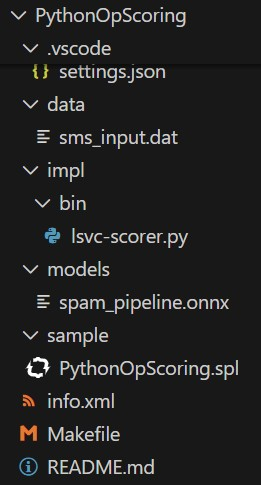

# Python and AI Series Part 1 - Introduction to PythonOp
Teracloud Streams provides a rich set of features for applications to incorporate AI.  AI can be applied at any stage of a Streams application topology. In a common pattern, a Streams application ingests and organizes massive volumes of data from diverse sources, preparing those streams for a real-time decision step. AI often powers this decision logic, such as scoring against a machine-learning model or using an LLM to generate a recommended action. 

A Streams application might also apply AI earlier in the pipeline, such as, detecting objects in a video stream or converting spoken audio into text for downstream analytics.

Because Python provides access to an extensive ecosystem of AI and machine-learning libraries, Streams applications often leverage Python for these capabilities. Teracloud Streams supports several mechanisms for integrating Python into an application topology, and PythonOp is an easy-to-use feature designed for this purpose.

In the first installment of the Python and AI series, we introduce PythonOp as an easy way to achieve seamless integration with Python-based AI workflows. 

<!-- more -->

## Introducing PythonOp

PythonOp is available under the SPL Standard Toolkit (a fundamental set of operators that can be used to write SPL applications) starting in [Teracloud Streams release 7.2.0](https://streams.teracloud.com/releases/7.2.0#version-7200). Unlike other standard operators, PythonOp processes tuples using Python code, which may range from a simple script to a full program, and is the easiest way to integrate Python into a Streams application.

## Sample Application

A sample application has been created to demonstrate the mechanics of using PythonOp in an SPL application.  In the sample, PythonOp is used to predict whether an SMS message is spam, using scikit-learn to score against a Linear Support Vector Classification (LSVC) model.

The [PythonOpScoring sample](https://github.com/teracloud-streams/samples/tree/main/PythonOpScoring) application contains the SPL application code, an LSVC model that was trained using the [UCI SMS Spam dataset](https://archive.ics.uci.edu/dataset/228/sms+spam+collection), and a subset of the dataset to use as input for scoring.

The flow graph below shows that the application consists of three operators:

1. A FileSource which reads SMS messages from a file.
1. A PythonOp that performs the scoring.
1. A FileSink that writes the scoring results to a file.

This sample is not intended to represent a full production Streams application. It is a minimal example designed specifically to demonstrate the mechanics of using PythonOp.

In a production scenario, a Streams application processing this type of data would typically:

* Process messages in real time as they arrive, rather than reading from an input file.
* Handle multiple message types (SMS/MMS, RCS, iMessage, etc.) originating from different data sources, each with its own schema.
* Include additional operators to ingest, preprocess, and normalize data from those sources before scoring.
* Filter out trivial or obvious cases that do not require model scoring.
* Leverage Streams constructs—such as load splitting, parallel processing paths, and cluster-wide scheduling to scale to the required throughput (for example, billions of messages per day).

### Application Structure
The sample consists of multiple files laid out into a Streams application directory structure.  The image below shows the file organization in VS Code.

* **PythonOpScoring** is root folder for the sample.
* **README.md** describes the sample and includes instructions on how to build and run the application.
* The **Makefile** is used to build the application.
* The Streams application, (i.e. the main composite) is in **sample/PythonOpScoring.spl**
* The Python script that PythonOp will invoke is in **impl/bin/lsvc-scorer.py**.  Streams expects scripts referenced by PythonOp to be in the impl/bin folder. 
* The pretrained model used for scoring is in **models/spam_pipeline.onnx**.
* The input data for the sample is in **data/sms_input.dat**.
* The **info.xml** file defines metadata for the sample application
 
#### PythonOp Invocation

Next, we focus on how the Python logic fits into our Streams application defined in [**PythonOpScoring.spl**](https://github.com/teracloud-streams/samples/blob/main/PythonOpScoring/sample/PythonOpScoring.spl).  The code snippet shown below highlights the PythonOp operator, which is the 2nd operator in our flow.

Notice how the invocation of PythonOp is consistent with the way any operator is invoked in SPL.  It specifies the stream of tuples it will consume (SampleData) and defines the schema and output stream for the tuples it will produce (Scoring).  All PythonOp invocations use the required parameter **module** to identify the Python script that the operator will use.  This particular use of PythonOp for scoring defines an additional parameter **modelsDir** that is used to specify the location of the model file that the Python script will use.

#### Python Script

Python scripts invoked by PythonOp must include a class that implements the Streams Python Operator API. A class that implements the Operator API will:

* initialize itself to create state and perform upfront processing that doesn't have to be repeated for each tuple
* process tuples one at a time as they arrive (to deliver real-time analysis)
* produce output tuples that are consumable by other operators in the Streams application

Let's look at the [**lsvc-scorer.py**](https://github.com/teracloud-streams/samples/blob/main/PythonOpScoring/impl/bin/lsvc-scorer.py) Python script that the operator uses. The script contains a class that implements several methods necessary to support the Operator API, but we will focus on two key methods.

The **__init__()** method performs one-time setup tasks to get the operator ready to process individual tuples.  The code in this method:

* locates the model file
* loads and introspects the model
* prepares input and output variables used in the scoring

The **processTuple()** method will perforn the analysis of individual tuples.  This method:

* extracts the message attribute from the input tuple
* packages the message into a structure that the model expects 
* runs the scoring
* prints scoring details to stdout 
* constructs and submits the output tuple

The other methods in the class only require trivial, default implementations.

## Summary
PythonOp offers a simple and effective way to integrate Python-based AI and machine-learning logic into Teracloud Streams applications. By allowing Python code to participate directly in the streaming topology, PythonOp makes it easy to combine real-time, scalable stream processing with the rich Python AI ecosystem. This introductory example demonstrates the basic mechanics of PythonOp.  Future articles in this series will build on these foundations and explore more advanced integration techniques and depolyment scenarios.

## Feedback
If you ever have any questions, comments or suggestions for the Teracloud Streams team, feel free to [contact us](https://streams.teracloud.com/contact).
