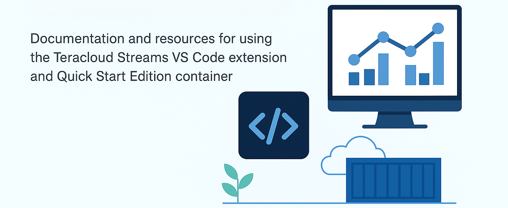

---
hide:
  - navigation
---

# Teracloud Streams Developer Tools

Welcome to the **Teracloud Streams Developer Tools** site — your hub for getting started quickly and extending your Streams experience with modern development tools.

This site is a companion to the [official Teracloud Streams product documentation](https://doc.streams.teracloud.com) and focuses specifically on:

- **Quick Start Edition Container** — run Streams locally with minimal setup  
<!--- **VS Code Extension** — develop and manage Streams apps directly from your IDE  -->
- **Blog** — updates, insights, and best practices  

---

## Get Started

### Quick Start Container
Run Teracloud Streams locally in minutes using the Quick Start container. Perfect for evaluation, experimentation, or lightweight development.  

👉 [Quick Start Guide](quickstart/index.md)

---
<!--
### Visual Studio Code Extension
Integrate Streams development into your workflow with syntax highlighting, job submission, and instance management right inside VS Code.  

👉 [VS Code Extension](vscode/index.md)

---
-->
### Blog & Updates
Stay informed with the latest posts about Streams tools, new features, and tips from the Teracloud team.  

👉 [Visit the Blog](blog/index.md)

---

*This site is maintained by the Teracloud Streams team and is dedicated to developer-facing tools and quick-start resources.*
