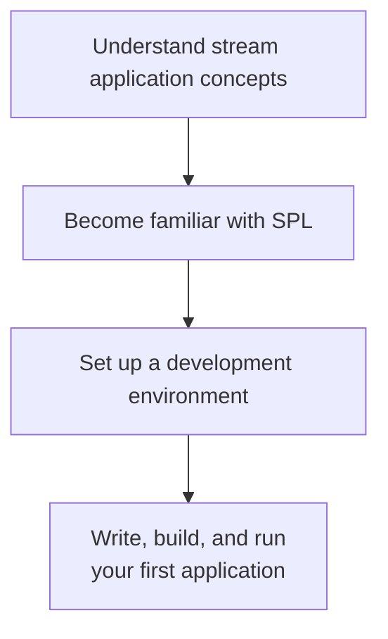
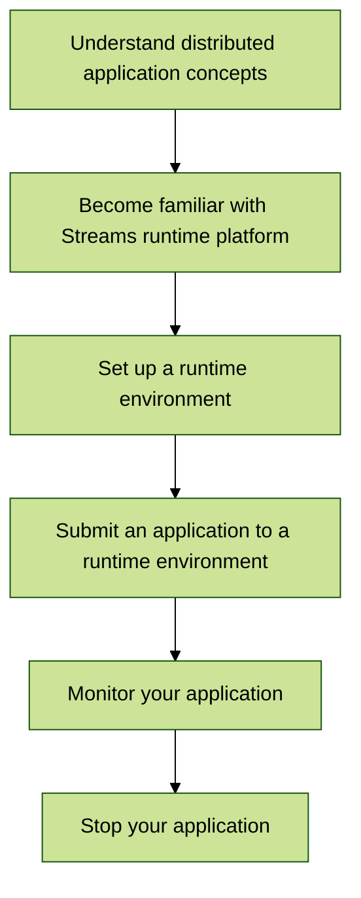

# Developing Stream Applications

Learn the basics of stream applications, set up a development and runtime environment, explore application monitoring tools, and delve into tutorials, examples, and other topics.

## The Developer Journey

See where you are in the stream application development journey and navigate to the appropriate stage.

### Basics

### Distributed applications

### Explore

- :material-pencil:  [More tutorials](https://doc.streams.teracloud.com/com.ibm.streams.tutorials.doc/doc/tut-container.html)
- :fontawesome-solid-exchange:  [Data Exchange](https://doc.streams.teracloud.com/com.ibm.streams.dev.doc/doc/enabling-streams-data-exchange.html)
- :material-feature-search:  [More SPL features](https://doc.streams.teracloud.com/com.ibm.streams.dev.doc/doc/spl_features.html)
- :material-tools:  [Available toolkits](https://doc.streams.teracloud.com/com.ibm.streams.toolkits.doc/spldoc/dita/toolkits/toolkits.html)

