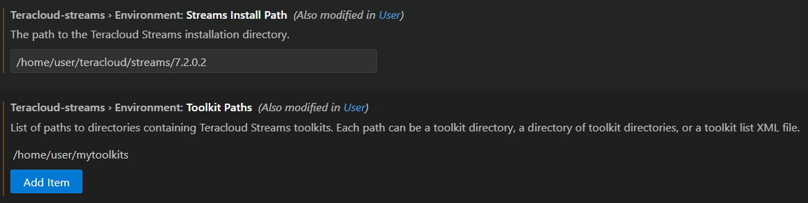

# Configuring the extension

In order to effectively develop applications with the extension, you must configure it to point to a Teracloud Streams install.

!!! note "Note"
    You can scope the extension configuration to the user, environment (container or remote host), or workspace in VS Code settings.

## Required: Configuring Streams Install Path

Without pointing to an install, the extension will not be able to:

* Provide code completion suggestions
* Provide function and operator documentation
* Build or run applications

To configure the install path:

1. Click [here](vscode://settings/teracloud-streams.environment.streamsInstallPath) to open the setting in VS Code, or navigate to Settings in VS Code and search for `streamsInstallPath`
1. Double-check the scope you want the setting at: `User`, `Remote`, or `Workspace`
1. Type in the location of the Streams install

## Configuring Toolkit Paths

After the Streams Install Path is configured, the extension will load the toolkits provided with the install. You can add additional **Toolkit Paths** to enable the extension to discover custom and third-party toolkits automatically. These toolkits provide additional operators and functions you can use in your SPL applications.

!!! tip "Tip"
    You can configure multiple toolkit paths if your development spans across shared or versioned toolkit directories.

## Example: Settings with paths configured

<picture>
  
</picture>

## Next steps

=== "Open an existing application"
    If you already have an application to work on, you can start leveraging the extension by opening an SPL file.
=== "Create a new application"
    See the steps in the [Creating a project or application](./spl-project-application.md) section.