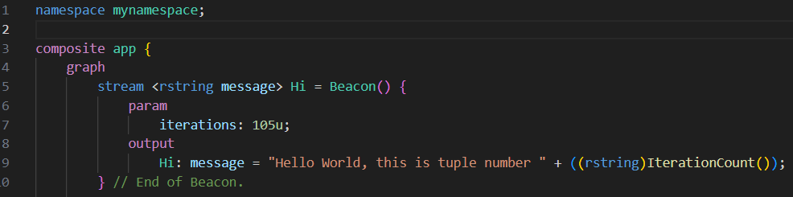

# Language server features

When an SPL file is open, the language server provides several features to improve reading and writing SPL code.

## Syntax highlighting and errors

Syntax highlighting for SPL files is provided to help differentiate keywords, types, functions, stream names, attributes, and more.

Additionally, if an SPL file does not have correct syntax, an error is reported in the editor and viewable in the PROBLEMS panel.

## Folding

Fold portions of code using folding icons of the left side of the editor.

## Find references

To find out where a stream or operator is used within a file or workspace, right-click on it and select `Go to References` or `Find All References`.

## IntelliSense

IntelliSense provides code hints, assistance, completions, and operator templates depending where your cursor is in the code. To trigger IntelliSense, 
enter ++ctrl+space++ (Windows/Linux) or ++cmd+space++ (macOS).

The language server is aware of types, functions, and operators provided by toolkits in the [configured Streams install and toolkit paths](../vscode/configuring-paths.md).

### View documentation

IntelliSense also provides quick info and documentation for parameters, functions, streams, and operators if available. Hover over an item to view its info or documentation.

## Formatting

Format a selection of code or a whole document by using the built-in **Format Document** or **Format Selection** commands. See the [VS Code Formatting documentation](https://code.visualstudio.com/docs/editing/codebasics#_formatting) for more info.