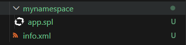
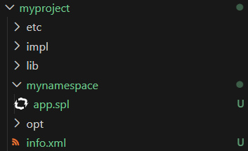

# Creating an SPL application or project

Learn the difference between a starter SPL application and a project and create them from scratch.

### Key differences

**SPL Application**: A minimal structure containing:

* A namespace directory
* An SPL file with a main composite (a composite operator with no inputs or outputs)
* An `info.xml` file with metadata about the application

!!! question "When to create an application"
    Create an application if you want to try out development, prototype behavior, or test simple applications.

**SPL Project**: A full application directory containing an SPL application and additional subdirectories for organizing artifacts like:

* Data files
* Configuration files
* Custom operators
* External dependencies

!!! question "When to create a project"
    Create a project if you're developing a production application or one that requires custom operators, configuration, and other supporting files. 

## Creating an SPL application

1. Right-click in an editor or File Explorer
1. Hover over `SPL Project`
1. Click `Add SPL Application` to open a wizard form
1. Fill in the namespace and main composite name details
1. Click the `Create Application` button

In the current workspace, a directory (named after the namespace) will be created and an SPL file (named after the main composite) will reside within it.
Additionally, an `info.xml` file will be created if one does not already exist. This file contains metadata about your application including the version and a description.

**Example: Created application**

## Creating an SPL project

1. Right-click in an editor or File Explorer
1. Hover over `SPL Project`
1. Click `Create SPL Project` to open a wizard form
1. Fill in the project name, namespace, and main composite name details
1. Click the `Create Project` button

In the current workspace, an application directory (named after the project) will be created along with several subdirectories and an `info.xml` file. 

To know more about a project's structure and the various subdirectories, see [Application directory files and structure](https://doc.streams.teracloud.com/com.ibm.streams.dev.doc/doc/application_directory_files_and_structure.html) in the product documentation.

**Example: Created project**

## Next steps

Open the newly created SPL file and [explore the features](./spl-language-features.md) provided by the SPL language server.